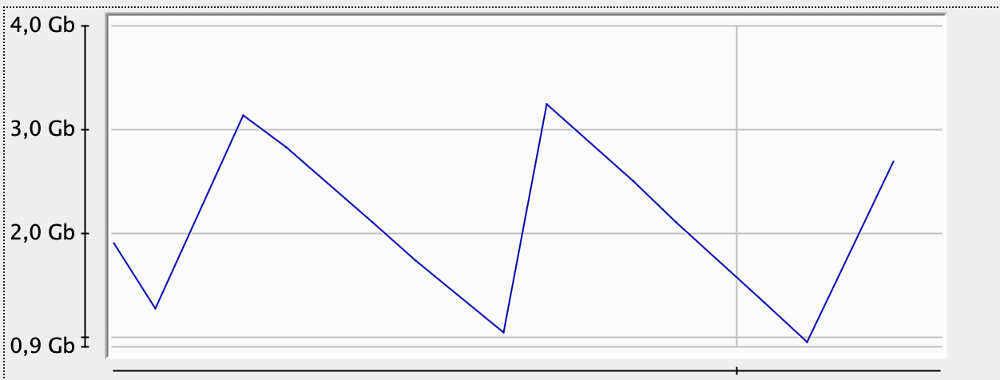
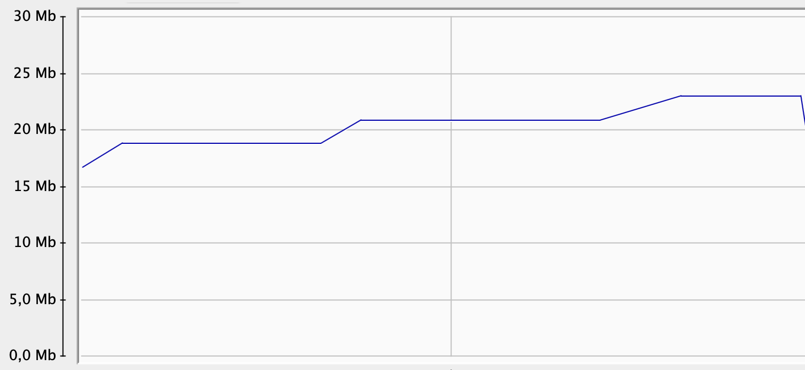

# Heap optimization

## Heap size vs execution time

| Heap size, MiB | Execution time, ms |
|----------------|--------------------|
| 256            | OOM                |
| 512            | 4636               |
| 1024           | 3796               |
| **2048**       | **3430**           |
| **4096**       | **3425**           |
| 8192           | 3745               |

Optimal heap size: 2 - 4 GiB

## Code optimization

### Consumed heap vs time before optimization

### Consumed heap vs time after optimization

